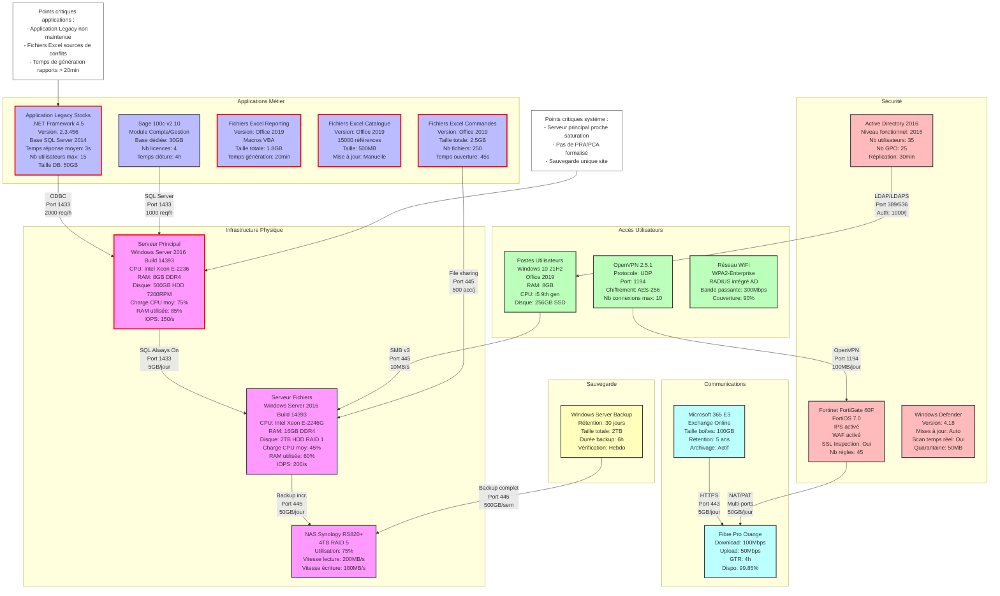

```mermaid
graph TB
    %% INFRASTRUCTURE PHYSIQUE
    subgraph "Infrastructure Physique"
        SRV1["Serveur Principal<br/>Windows Server 2016 Build 14393<br/>CPU: Intel Xeon E-2236<br/>RAM: 8GB DDR4<br/>Disque: 500GB HDD 7200RPM<br/>Charge CPU moy: 75%<br/>RAM utilisée: 85%<br/>IOPS: 150/s"]
        SRV2["Serveur Fichiers<br/>Windows Server 2016 Build 14393<br/>CPU: Intel Xeon E-2246G<br/>RAM: 16GB DDR4<br/>Disque: 2TB HDD RAID 1<br/>Charge CPU moy: 45%<br/>RAM utilisée: 60%<br/>IOPS: 200/s"]
        NAS["NAS Synology RS820+<br/>4TB RAID 5<br/>Utilisation: 75%<br/>Vitesse lecture: 200MB/s<br/>Vitesse écriture: 180MB/s"]
    end

    %% APPLICATIONS METIER
    subgraph "Applications Métier"
        APP1["Application Legacy Stocks<br/>.NET Framework 4.5<br/>Version: 2.3.456<br/>Base SQL Server 2014<br/>Temps réponse moyen: 3s<br/>Nb utilisateurs max: 15<br/>Taille DB: 50GB"]
        XLS1["Fichiers Excel Commandes<br/>Version: Office 2019<br/>Taille totale: 2.5GB<br/>Nb fichiers: 250<br/>Temps ouverture: 45s"]
        XLS2["Fichiers Excel Reporting<br/>Version: Office 2019<br/>Macros VBA<br/>Taille totale: 1.8GB<br/>Temps génération: 20min"]
        XLS3["Fichiers Excel Catalogue<br/>Version: Office 2019<br/>15000 références<br/>Taille: 500MB<br/>Mise à jour: Manuelle"]
        COMP["Sage 100c v2.10<br/>Module Compta/Gestion<br/>Base dédiée: 30GB<br/>Nb licences: 4<br/>Temps clôture: 4h"]
    end

    %% ACCES UTILISATEURS
    subgraph "Accès Utilisateurs"
        PC["Postes Utilisateurs<br/>Windows 10 21H2<br/>Office 2019<br/>RAM: 8GB<br/>CPU: i5 9th gen<br/>Disque: 256GB SSD"]
        VPN["OpenVPN 2.5.1<br/>Protocole: UDP<br/>Port: 1194<br/>Chiffrement: AES-256<br/>Nb connexions max: 10"]
        WIFI["Réseau WiFi<br/>WPA2-Enterprise<br/>RADIUS intégré AD<br/>Bande passante: 300Mbps<br/>Couverture: 90%"]
    end

    %% SECURITE
    subgraph "Sécurité"
        FW["Fortinet FortiGate 60F<br/>FortiOS 7.0<br/>IPS activé<br/>WAF activé<br/>SSL Inspection: Oui<br/>Nb règles: 45"]
        AD["Active Directory 2016<br/>Niveau fonctionnel: 2016<br/>Nb utilisateurs: 35<br/>Nb GPO: 25<br/>Réplication: 30min"]
        AV["Windows Defender<br/>Version: 4.18<br/>Mises à jour: Auto<br/>Scan temps réel: Oui<br/>Quarantaine: 50MB"]
    end

    %% SAUVEGARDE
    subgraph "Sauvegarde"
        BKUP["Windows Server Backup<br/>Rétention: 30 jours<br/>Taille totale: 2TB<br/>Durée backup: 6h<br/>Vérification: Hebdo"]
    end

    %% COMMUNICATIONS
    subgraph "Communications"
        MAIL["Microsoft 365 E3<br/>Exchange Online<br/>Taille boîtes: 100GB<br/>Rétention: 5 ans<br/>Archivage: Actif"]
        INT["Fibre Pro Orange<br/>Download: 100Mbps<br/>Upload: 50Mbps<br/>GTR: 4h<br/>Dispo: 99.85%"]
    end

    %% FLUX DE DONNEES
    SRV1 -->|"SQL Always On<br/>Port 1433<br/>5GB/jour"| SRV2
    SRV2 -->|"Backup incr.<br/>Port 445<br/>50GB/jour"| NAS
    PC -->|"SMB v3<br/>Port 445<br/>10MB/s"| SRV2
    APP1 -->|"ODBC<br/>Port 1433<br/>2000 req/h"| SRV1
    XLS1 -->|"File sharing<br/>Port 445<br/>500 acc/j"| SRV2
    COMP -->|"SQL Server<br/>Port 1433<br/>1000 req/h"| SRV1
    AD -->|"LDAP/LDAPS<br/>Port 389/636<br/>Auth: 1000/j"| PC
    BKUP -->|"Backup complet<br/>Port 445<br/>500GB/sem"| NAS
    MAIL -->|"HTTPS<br/>Port 443<br/>5GB/jour"| INT
    VPN -->|"OpenVPN<br/>Port 1194<br/>100MB/jour"| FW
    FW -->|"NAT/PAT<br/>Multi-ports<br/>50GB/jour"| INT

    %% NOTES SPECIFIQUES
    note_infra[Points critiques système :<br/>- Serveur principal proche saturation<br/>- Pas de PRA/PCA formalisé<br/>- Sauvegarde unique site]
    note_app[Points critiques applications :<br/>- Application Legacy non maintenue<br/>- Fichiers Excel sources de conflits<br/>- Temps de génération rapports > 20min]

    %% LIAISON DES NOTES
    note_infra --> SRV1
    note_app --> APP1

    %% ZONES VULNERABLES - Marquées en rouge
    style XLS1 stroke:#f00,stroke-width:3px
    style XLS2 stroke:#f00,stroke-width:3px
    style XLS3 stroke:#f00,stroke-width:3px
    style APP1 stroke:#f00,stroke-width:3px
    style SRV1 stroke:#f00,stroke-width:3px

    %% STYLE DES COMPOSANTS
    classDef infrastructure fill:#f9f,stroke:#333,stroke-width:2px
    classDef applications fill:#bbf,stroke:#333,stroke-width:2px
    classDef users fill:#bfb,stroke:#333,stroke-width:2px
    classDef security fill:#fbb,stroke:#333,stroke-width:2px
    classDef backup fill:#ffb,stroke:#333,stroke-width:2px
    classDef comms fill:#bff,stroke:#333,stroke-width:2px
    classDef note fill:#fff,stroke:#333,stroke-width:1px

    class SRV1,SRV2,NAS infrastructure
    class APP1,XLS1,XLS2,XLS3,COMP applications
    class PC,VPN,WIFI users
    class FW,AD,AV security
    class BKUP backup
    class MAIL,INT comms
    class note_infra,note_app note
```
